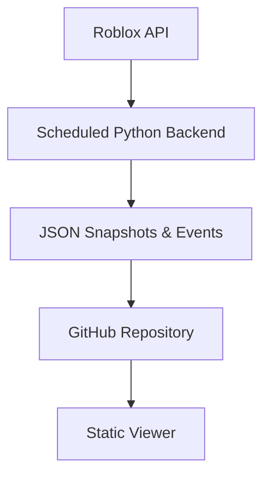

# The Division Database


**Viewer:** [https://r-surrected.github.io/division-database/viewer.html](https://r-surrected.github.io/division-database/viewer.html) 

**Discord:** [https://discord.gg/MtFWkQdzru](https://discord.gg/MtFWkQdzru)

---

## Overview

The Division Database is a database that uses snapshots (API gets lists of everyone in divisions, gets their names and other info) to track changes over time. It tracks the changes in City-17 HL2RP's Roblox groups using an offline python script, the frontend is purely a data viewer.

It's main goal is to be an automated system that tracks all of these changes for convienience. It's easy to look up someone's name and see a history of where they've been or what happened to them.

The Division Dashboard refers to the data viewer itself but the database is the backend and the entire project.

---

## Why I made this

I’ve been part of the City-17 community on and off since 2020, and division history has always been difficult to keep up with. In these communities, you'll constantly hear things like:

- “They joined JURY”
- “They transferred to RAZOR”
- “They got promoted”
- “They discharged”

Even while I was still in divisions, it was still hard to track who did what. Now that there are so many more people in divisions, this is needed exponentially more.

---

## Architecture

Data generation and data presentation are intentionally separated.

The backend is a python script that calls the Roblox API for current group status, figures out the changes that have happened, exports everything to json, and pushes to this repo. 

The web viewer is fully static and read-only. It does not fetch live data and performs no writes. All of the backend is done with an python script I run on a personal headless server.



---


## Example event


```json
{
  "type": "division_transfer",
  "user": "ExampleUser",
  "from": "JURY",
  "to": "RAZOR",
  "date": "2025-01-14"
}
```


