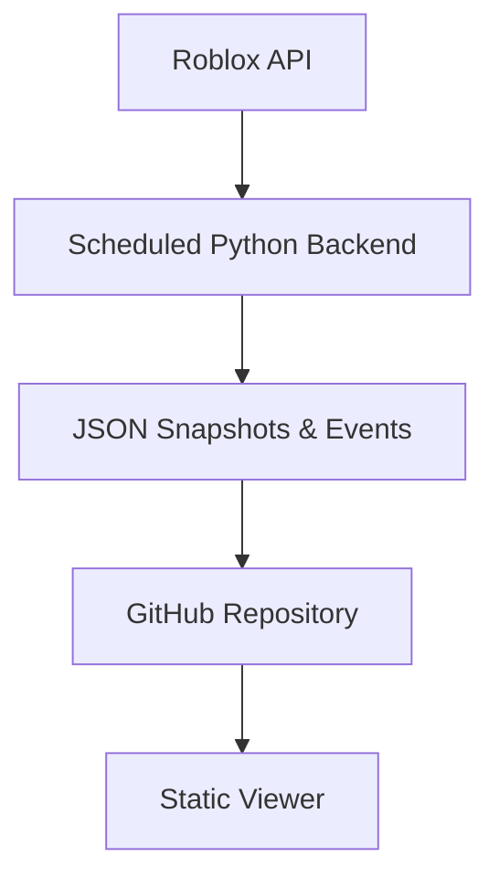

# The Division Database

> A snapshot-driven history of division and OTA roster changes for City-17's HL2RP Roblox groups.


**Viewer:** https://r-surrected.github.io/division-database/viewer.html  
**Discord:** https://discord.gg/MtFWkQdzru

---

## Overview

The Division Database is a public, snapshot-driven database with a static web viewer that tracks division and OTA roster changes over time for City-17 HL2RP Roblox groups.

It exists to preserve how group membership changes over time without requiring anyone to manually track joins, transfers, promotions, or discharges.

---

## Why I made this

I’ve been part of the City-17 community on and off since 2020, and division history has always been difficult to keep up with. You constantly hear things like:

- “They joined JURY”
- “They transferred to RAZOR”
- “They got promoted”
- “They discharged”

Once enough time passes, reconstructing what actually happened becomes guesswork. This project exists to make that history concrete and accessible.

---

## Architecture

Data generation and data presentation are intentionally separated.

A scheduled Python backend runs offline once per day at 12:00 PM Eastern Standard Time, captures the current state of relevant Roblox groups, compares it against the previous snapshot, and derives change events. The resulting snapshots and events are exported as JSON and pushed to this repository.

The web viewer is fully static and read-only. It does not fetch live data and performs no writes.



---


## Example event


```json
{
  "type": "division_transfer",
  "user": "ExampleUser",
  "from": "JURY",
  "to": "RAZOR",
  "date": "2025-01-14"
}
```
